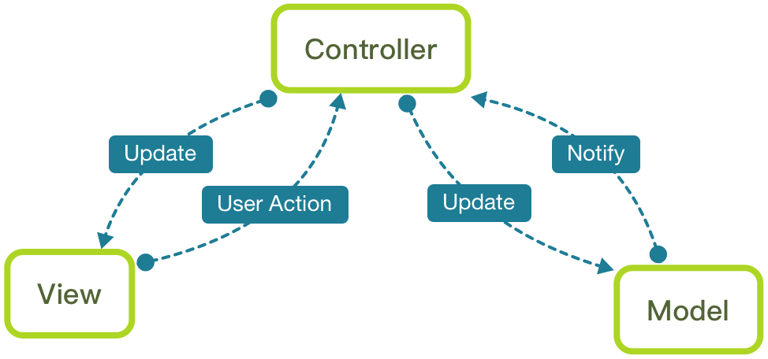
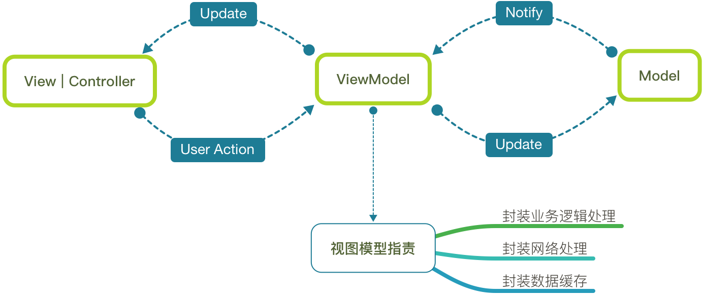

#

<h3 size=20>Swift综合性项目(持续更新中),如果帮助到你，麻烦给个star ⭐️ ⭐️⭐️。</h3>

#
#

<h3>iOS 综合性项目请到 : https://github.com/NShunjian/IOSProject</h3>

#
# SwiftProject
Swift综合性项目

<h2>MVVM</h2>

MVVM 是 Model-View-ViewModel 的简写，MVVM 模式和 MVC 模式一样，主要目的是分离视图（View）和模型（Model）

MVC 回顾

*MVC 结构图

* MVC 存在的问题
* 模型的代码很少
* 控制器的代码一不小心就越来越多
* 不好测试

<h2>MVVM</h2>

*MVVM 结构图

<p1> MVVM 概念</p1>
* 在 MVVM 中，view 和 view controller 正式联系在一起，我们把它们视为一个组件
* view 和 view controller 都不能直接引用 model，而是引用视图模型
* view model 是一个放置用户输入验证逻辑，视图显示逻辑，发起网络请求和其他代码

<p1> MVVM 使用注意事项</p1>
* view 引用 view model，但反过来不行
* view model 引用了 model，但反过来不行
* 如果我们破坏了这些规则，便无法正确地使用 MVVM

<p1>MVVM 的优点</p1>
* 低耦合：View 可以独立于 Model 变化和修改，一个 ViewModel 可以绑定到不同的 View 上
* 可重用性：可以把一些视图逻辑放在一个 ViewModel 里面，让很多 view 重用这段视图逻辑
* 独立开发：开发人员可以专注于业务逻辑和数据的开发 ViewModel，设计人员可以专注于页面设计
* 可测试：通常界面是比较难于测试的，而 MVVM 模式可以针对 ViewModel 来进行测试

